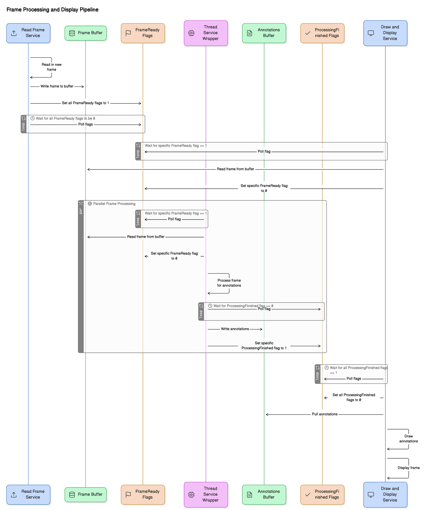

# Automated Driver Assistance System  
This project implements an ADAS system with four services using a combination of first principles and machine learning techniques. These services include:  
- Traffic light detection (YOLO model) – *Lucas*  
- Pedestrian detection (YOLO model) – *Himanshu*  
- Lane line detection (first principles) – *Akshay*  
- Car detection (first principles) – *Taiga*  

Make the project:
```
make clean && make
```
Run on a target video:
```
./adas_app <target-video>
```
Run using the camera:
```
./adas_app
```
## System Overview  
Our objective was to run all four services at a target of 30 FPS. We achieved this by:  
- Using atomic flags and synchronization techniques  
- Applying the Blackboard architecture  
- Threading each individual service with PThreads  
- Assigning core affinity to each thread  
- Deploying YOLO models with TensorRT  
- Applying compile-time optimizations via OpenMP  

## Synchronization System

At a high level, the system has three main services:

1. **ReadFrame** – reads frames and writes them to a shared frame buffer.
2. **ServiceWrapper** – reads frames from the buffer, runs them through its assigned annotation service (e.g., detection model), and writes results to an annotations buffer.
3. **DrawFrame** – reads the frame, applies annotations from all annotation buffers, and renders the final output.

Two sets of 8-bit flags—**FrameReady** and **ProcessingFinished**—manage synchronization. At initialization, each service (except ReadFrame) is assigned a unique bit. After ReadFrame writes a frame, it sets all bits in the FrameReady flag to 1. Each ServiceWrapper polls its assigned bit; once it reads the frame, it resets its bit to 0. ReadFrame waits for all bits to be 0 before writing the next frame.

Each ServiceWrapper uses a function pointer to call its detection service and writes results to its dedicated annotations buffer. It then sets its bit in the ProcessingFinished flag to signal DrawFrame that annotations are ready. DrawFrame waits for a new frame, then polls the ProcessingFinished flag until all bits are set, retrieves the annotations, applies them, and draws the frame. This architecture maintains synchronization at critical points while allowing parallel work for performance.



## Traffic Lights

## Pedestrians

## Lane Lines

## Cars